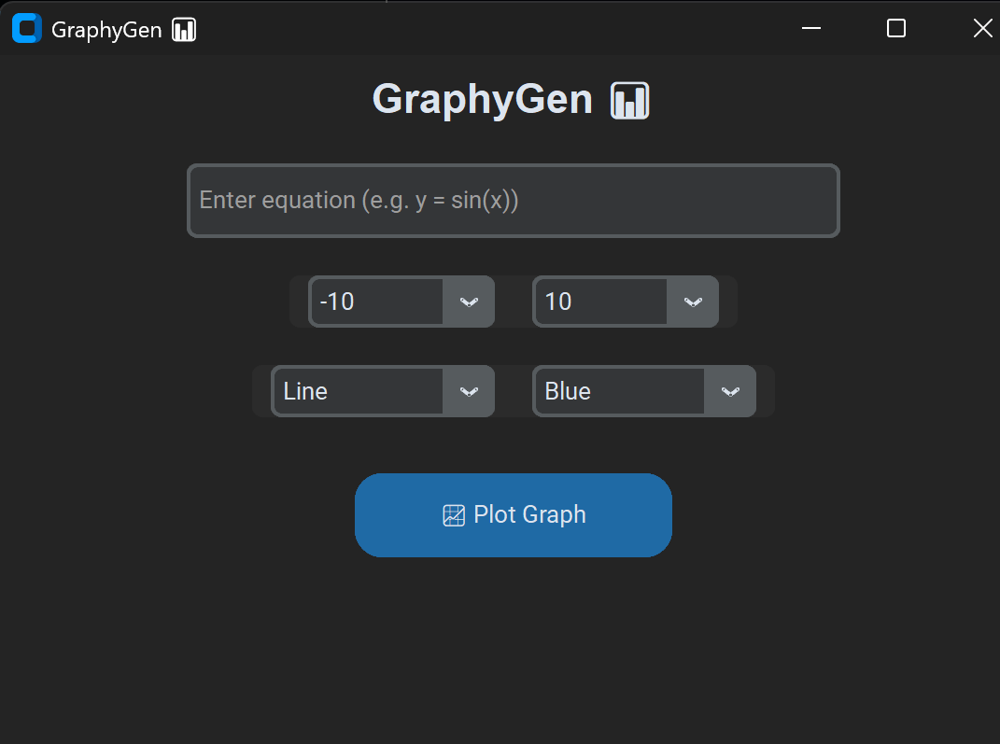

# 📊 GraphyGen

GraphyGen is a modern Python-based graph plotting application that allows users to quickly generate mathematical graphs by entering equations. Built with **CustomTkinter** for an attractive UI, **Sympy** for equation parsing, and **Matplotlib** for plotting, GraphyGen makes equation visualization simple and customizable.

---

## ✨ Features

* 🖊️ Enter any equation in terms of `x` (e.g., `y = sin(x)`, `x^2 + 2*x + 1`).
* 📏 Set a **custom X-axis range** (with dropdown presets and manual entry).
* 🎨 Choose **graph style** (Line, Dashed, Dotted, Scatter).
* 🌈 Select **graph colors** (Blue, Red, Green, Cyan, Magenta, Yellow, Black).
* 📋 Equation automatically appears as the **title and legend**.
* ⚡ Clean, modern UI with **dark mode** support.

---

## 🛠️ Tech Stack

* **Python 3.x**
* **CustomTkinter** → modern Tkinter-based UI
* **Matplotlib** → plotting graphs
* **Sympy** → parsing math equations
* **NumPy** → efficient array computations

---

## 🚀 Installation

1. Clone this repository:

   ```bash
   git clone https://github.com/Lucky-Joshi/graphyGen.git
   cd graphyGen
   ```

2. Install dependencies:

   ```bash
   pip install customtkinter matplotlib sympy numpy
   ```

3. Run the app:

   ```bash
   python main.py
   ```

---

## 📸 Screenshots



---

## 🎯 Usage

1. Enter your equation (e.g., `y = sin(x)`).
2. Select the X range (`-10 to 10`, `-90 to 90`, or custom).
3. Choose **graph style** and **color**.
4. Click **📈 Plot Graph** to see the graph.

Example Inputs:

* `sin(x)`
* `x^2 + 2*x + 1`
* `exp(x)`
* `log(x)`

---

## 🔮 Upcoming Features

* ➕ Support for **multiple equations** on the same plot.
* 🎨 Custom color picker.
* 💾 Save graphs as PNG/JPG.
* 🖱️ Interactive zoom & pan.

---

## 🤝 Contributing

Pull requests are welcome! If you’d like to suggest major changes, please open an issue first to discuss what you’d like to change.

---

## 📜 License

This project is licensed under the MIT License.

---

👨‍💻 Developed by Lucky
